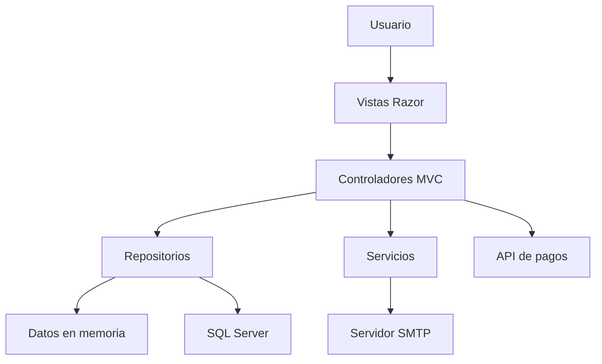
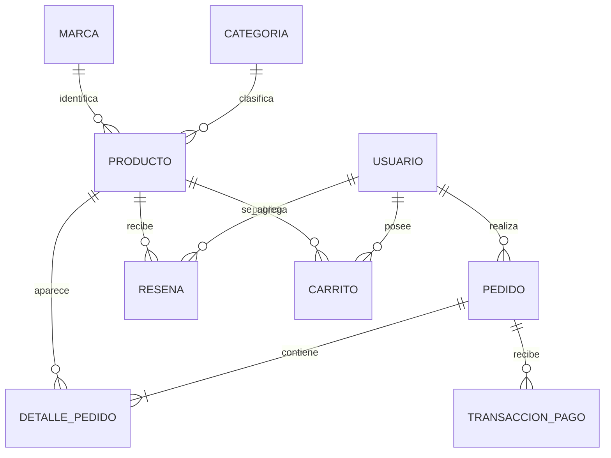
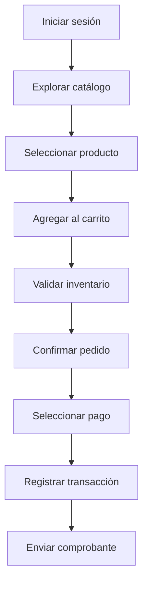

<div align="center">


# Scentify

### Sistema web para la gestión y comercialización de perfumes

Aplicación de comercio electrónico desarrollada con **ASP.NET Core MVC**, orientada a la administración de productos, clientes, pedidos, pagos, inventario y reseñas de una perfumería en línea.

[](https://dotnet.microsoft.com/)
[](https://learn.microsoft.com/aspnet/core/)
[](https://learn.microsoft.com/dotnet/csharp/)
[](https://www.microsoft.com/sql-server)
[](https://getbootstrap.com/)

</div>

---

## Tabla de contenido

1. [Descripción general](#descripción-general)
2. [Objetivo del proyecto](#objetivo-del-proyecto)
3. [Características principales](#características-principales)
4. [Tipos de usuario](#tipos-de-usuario)
5. [Tecnologías utilizadas](#tecnologías-utilizadas)
6. [Arquitectura del sistema](#arquitectura-del-sistema)
7. [Estructura del proyecto](#estructura-del-proyecto)
8. [Modelo funcional](#modelo-funcional)
9. [Requisitos previos](#requisitos-previos)
10. [Instalación y ejecución](#instalación-y-ejecución)
11. [Configuración](#configuración)
12. [Usuarios de demostración](#usuarios-de-demostración)
13. [Flujo de compra](#flujo-de-compra)
14. [Pruebas recomendadas](#pruebas-recomendadas)
15. [Seguridad](#seguridad)
16. [Limitaciones actuales](#limitaciones-actuales)
17. [Mejoras futuras](#mejoras-futuras)
18. [Autor](#autor)

---

## Descripción general

**Scentify** es una aplicación web de comercio electrónico diseñada para apoyar la operación de una perfumería en línea. El sistema permite administrar el catálogo de fragancias, controlar las existencias, registrar usuarios, gestionar carritos de compra, generar pedidos, procesar diferentes métodos de pago y consultar el historial de transacciones.

La aplicación cuenta con interfaces diferenciadas para clientes y administradores. Los clientes pueden explorar el catálogo, aplicar filtros, consultar los detalles de cada producto, agregar artículos al carrito, confirmar pedidos, registrar reseñas y revisar su actividad. Los administradores tienen acceso a herramientas para gestionar productos, marcas, categorías, usuarios, pedidos, pagos y bitácoras.

El proyecto fue desarrollado aplicando el patrón **Modelo–Vista–Controlador (MVC)**, separación de responsabilidades mediante repositorios y servicios, validaciones del lado del servidor y una interfaz adaptable a distintos tamaños de pantalla.

> **Estado del proyecto:** prototipo académico funcional. Algunas operaciones utilizan almacenamiento temporal en memoria y el panel estadístico administrativo consulta SQL Server.

---

## Objetivo del proyecto

Desarrollar una plataforma web moderna y organizada que permita digitalizar los principales procesos comerciales de una perfumería, ofreciendo una experiencia sencilla para los clientes y herramientas de control para los administradores.

### Objetivos específicos

- Centralizar la información de productos, marcas y categorías.
- Facilitar la consulta y compra de perfumes desde una interfaz web.
- Controlar el inventario disponible antes de confirmar una compra.
- Gestionar usuarios con distintos niveles de acceso.
- Registrar pedidos, detalles de compra y transacciones de pago.
- Proporcionar estadísticas relevantes para la administración.
- Permitir que los clientes publiquen calificaciones y comentarios.
- Mantener una bitácora de las operaciones importantes realizadas.
- Enviar comprobantes y notificaciones mediante correo electrónico.

---

## Características principales

### Catálogo de productos

- Visualización de perfumes y otros productos disponibles.
- Información detallada de nombre, descripción, precio y existencias.
- Clasificación por marca y categoría.
- Identificación del género y tamaño de cada fragancia.
- Aplicación de descuentos.
- Imágenes externas para representar los productos.
- Paginación del catálogo.
- Ordenamiento alfabético y por precio.
- Filtros por marca, categoría, rango de precio y disponibilidad.

### Gestión del carrito

- Agregar productos desde el catálogo.
- Seleccionar la cantidad deseada.
- Validar las existencias disponibles.
- Actualizar cantidades.
- Eliminar artículos.
- Calcular subtotales y total de la compra.
- Confirmar la dirección y los datos de entrega.
- Convertir el carrito en un pedido.

### Gestión de pedidos

- Creación de pedidos a partir del carrito.
- Registro de dirección de envío.
- Registro del teléfono de contacto.
- Inclusión de notas adicionales.
- Consulta del estado del pedido.
- Visualización del detalle de productos adquiridos.
- Filtrado administrativo por usuario y fechas.
- Historial de pedidos para cada cliente.

### Procesamiento de pagos

El sistema contempla diferentes métodos de pago:

- Tarjeta.
- SINPE Móvil.
- Transferencia.
- Efectivo.
- PayPal.
- Stripe.

Para las operaciones con tarjeta se utiliza una API externa de validación. Una vez registrado el pago, el sistema genera un código de transacción y puede enviar un comprobante al correo electrónico del cliente.

> Las opciones PayPal y Stripe incluidas en esta versión redirigen a sus respectivos sitios. No representan todavía una integración completa con sus SDK oficiales.

### Administración de inventario

- Creación de productos.
- Modificación de información.
- Eliminación de productos.
- Control de existencias.
- Registro de descuentos.
- Asociación con categorías y marcas.
- Administración de imágenes mediante URL.

### Usuarios y sesiones

- Registro de clientes.
- Inicio y cierre de sesión.
- Manejo de sesiones con duración configurable.
- Diferenciación entre clientes y administradores.
- Protección global de las páginas privadas.
- Recuperación de contraseña mediante correo electrónico.
- Administración de usuarios.

### Reseñas

- Publicación de calificaciones.
- Registro de comentarios.
- Asociación de la reseña con el cliente y el producto.
- Consulta de reseñas desde el detalle del producto.
- Edición y eliminación de reseñas.

### Paneles de información

#### Panel del cliente

- Resumen de pedidos realizados.
- Pedidos que todavía se encuentran en proceso.
- Cantidad total de productos comprados.
- Últimos pedidos registrados.
- Productos comprados con mayor frecuencia.

#### Panel administrativo

- Total de ventas.
- Cantidad total de pedidos.
- Total de productos vendidos.
- Producto más vendido.
- Ventas agrupadas por mes.
- Productos con mayor cantidad de ventas.
- Ventas por categoría.
- Ventas por marca.
- Compras agrupadas por usuario.

### Bitácoras

- Registro de operaciones sobre los módulos principales.
- Identificación de la tabla afectada.
- Tipo de acción realizada.
- Usuario responsable.
- Fecha de la operación.
- Descripción del movimiento.
- Módulo preparado para la consulta de errores.

---

## Tipos de usuario

| Usuario | Funciones principales |
|---|---|
| **Cliente** | Consultar productos, utilizar filtros, revisar detalles, gestionar el carrito, confirmar compras, consultar pedidos, registrar pagos y publicar reseñas. |
| **Administrador** | Gestionar productos, usuarios, marcas, categorías, pedidos, transacciones, reseñas, inventario, bitácoras y estadísticas administrativas. |

---

## Tecnologías utilizadas

| Tecnología | Uso dentro del proyecto |
|---|---|
| **.NET 8** | Plataforma principal de ejecución. |
| **ASP.NET Core MVC** | Desarrollo de controladores, vistas y rutas. |
| **C#** | Lógica de negocio y procesamiento del servidor. |
| **Razor** | Construcción dinámica de las vistas `.cshtml`. |
| **SQL Server** | Fuente de información del panel estadístico administrativo. |
| **Microsoft.Data.SqlClient** | Consultas directas al panel de estadísticas. |
| **Entity Framework Core 8** | Dependencias preparadas para persistencia con SQL Server. |
| **Bootstrap** | Diseño adaptable y componentes visuales. |
| **CSS3** | Personalización de la interfaz y estilo visual. |
| **JavaScript** | Interacciones dinámicas del catálogo, carrito y formularios. |
| **jQuery Validation** | Validaciones complementarias en el cliente. |
| **X.PagedList** | Paginación del catálogo de productos. |
| **SMTP** | Envío de comprobantes y correos de recuperación. |
| **Git y GitHub** | Control de versiones y documentación del código. |

---

## Arquitectura del sistema

Scentify utiliza el patrón arquitectónico **MVC**, complementado por una capa de repositorios y una capa de servicios.



### Responsabilidades por capa

| Capa | Responsabilidad |
|---|---|
| **Models** | Representar las entidades y aplicar validaciones de datos. |
| **Views** | Mostrar la interfaz y recibir las acciones del usuario. |
| **Controllers** | Coordinar las solicitudes, validaciones y respuestas. |
| **Repositories** | Gestionar el acceso y manipulación de los datos. |
| **Services** | Encapsular funcionalidades externas, como el correo electrónico. |
| **wwwroot** | Almacenar estilos, scripts, imágenes y librerías del cliente. |

---

## Estructura del proyecto

```text
Scentify/
├── Controllers/
│   ├── BitacoraErroresController.cs
│   ├── BitacoraTransaccionesController.cs
│   ├── CarritoCompraController.cs
│   ├── CategoriaController.cs
│   ├── ClienteDashboardController.cs
│   ├── DashboardController.cs
│   ├── DetallePedidoController.cs
│   ├── HomeController.cs
│   ├── LoginController.cs
│   ├── MarcaController.cs
│   ├── PedidoController.cs
│   ├── ProductoController.cs
│   ├── RegistroController.cs
│   ├── ResenaController.cs
│   ├── TransaccionPagoController.cs
│   └── UsuarioController.cs
│
├── Data/
│   ├── MockDatabase.cs
│   ├── BitacoraErroresRepository.cs
│   ├── BitacoraTransaccionesRepository.cs
│   ├── CarritoCompraRepository.cs
│   ├── CategoriaRepository.cs
│   ├── ClienteDashboardRepository.cs
│   ├── DetallePedidoRepository.cs
│   ├── MarcaRepository.cs
│   ├── PedidoRepository.cs
│   ├── ProductoRepository.cs
│   ├── ResenaRepository.cs
│   ├── TransaccionPagoRepository.cs
│   └── UsuarioRepository.cs
│
├── Models/
│   ├── BitacoraErrores.cs
│   ├── BitacoraTransacciones.cs
│   ├── CarritoCompra.cs
│   ├── Categoria.cs
│   ├── DashboardViewModel.cs
│   ├── DetallePedido.cs
│   ├── Login.cs
│   ├── Marca.cs
│   ├── PagoPasarela.cs
│   ├── Pedido.cs
│   ├── Producto.cs
│   ├── ProductoCompradoEstadistica.cs
│   ├── Resena.cs
│   ├── TransaccionPago.cs
│   └── Usuario.cs
│
├── Services/
│   ├── IEmailService.cs
│   └── EmailService.cs
│
├── Views/
│   ├── CarritoCompra/
│   ├── Categoria/
│   ├── ClienteDashboard/
│   ├── Dashboard/
│   ├── DetallePedido/
│   ├── Home/
│   ├── Marca/
│   ├── Pedido/
│   ├── Producto/
│   ├── Resena/
│   ├── Shared/
│   ├── TransaccionPago/
│   └── Usuario/
│
├── wwwroot/
│   ├── css/
│   ├── Images/
│   ├── js/
│   └── lib/
│
├── appsettings.json
├── Program.cs
├── Scentify.csproj
└── Scentify.sln
```

---

## Modelo funcional

Las principales entidades manejadas por el sistema son:

| Entidad | Descripción |
|---|---|
| **Usuario** | Información personal, credenciales, rol y estado de la cuenta. |
| **Producto** | Perfume o artículo disponible dentro del catálogo. |
| **Categoría** | Clasificación general de los productos. |
| **Marca** | Fabricante o marca comercial del producto. |
| **CarritoCompra** | Productos seleccionados temporalmente por el cliente. |
| **Pedido** | Registro principal de una compra confirmada. |
| **DetallePedido** | Productos y cantidades relacionados con un pedido. |
| **TransaccionPago** | Información del método, monto y estado del pago. |
| **Reseña** | Calificación y comentario publicado por un cliente. |
| **BitacoraTransacciones** | Historial de operaciones importantes del sistema. |
| **BitacoraErrores** | Registro preparado para almacenar errores técnicos. |

### Relaciones principales



---

## Requisitos previos

Antes de ejecutar el proyecto se necesita:

- **Windows, Linux o macOS**.
- **.NET SDK 8.0** o superior compatible.
- **Visual Studio 2022**, Visual Studio Code o Rider.
- **SQL Server 2019 o posterior**, si se utilizará el panel administrativo.
- Conexión a Internet para:
  - Restaurar paquetes NuGet.
  - Cargar las imágenes externas del catálogo.
  - Acceder a la API externa de pagos.
  - Enviar correos mediante SMTP.
- Una cuenta SMTP válida para probar el envío de correos.

### Verificar la instalación de .NET

```bash
dotnet --version
```

El resultado debe indicar una versión `8.x` o superior compatible.

---

## Instalación y ejecución

### 1. Clonar el repositorio

```bash
git clone https://github.com/Dariel17-mo/Scentifyy.git
cd Scentifyy
```

También se puede descargar el proyecto como archivo ZIP desde GitHub y extraerlo en una carpeta local.

### 2. Restaurar las dependencias

```bash
dotnet restore
```

### 3. Configurar los valores del entorno

Configura la conexión a SQL Server y las credenciales SMTP mediante secretos de usuario o variables de entorno. No publiques contraseñas dentro de `appsettings.json`.

La sección [Configuración](#configuración) contiene los comandos necesarios.

### 4. Compilar el proyecto

```bash
dotnet build
```

La compilación debe finalizar sin errores.

### 5. Ejecutar la aplicación

```bash
dotnet run
```

Según los perfiles incluidos en el proyecto, la aplicación estará disponible en:

```text
https://localhost:7060
```

o:

```text
http://localhost:5113
```

Si el navegador muestra una advertencia por el certificado HTTPS local, se puede confiar en el certificado de desarrollo ejecutando:

```bash
dotnet dev-certs https --trust
```

### Ejecución desde Visual Studio

1. Abrir el archivo `Scentify.sln`.
2. Esperar a que Visual Studio restaure los paquetes.
3. Seleccionar el perfil `https`.
4. Presionar `F5` para depurar o `Ctrl + F5` para ejecutar sin depuración.

---

## Configuración

### Configuración base

El archivo `appsettings.json` puede conservar únicamente valores generales y configuraciones sin información sensible:

```json
{
  "Logging": {
    "LogLevel": {
      "Default": "Information",
      "Microsoft.AspNetCore": "Warning"
    }
  },
  "AllowedHosts": "*",
  "ConnectionStrings": {
    "DefaultConnection": ""
  },
  "Email": {
    "FromName": "Scentify",
    "From": "",
    "Smtp": "smtp.gmail.com",
    "Port": "587",
    "User": "",
    "Pass": ""
  }
}
```

### Configurar SQL Server con User Secrets

Dentro de la carpeta del proyecto, ejecutar:

```bash
dotnet user-secrets init
dotnet user-secrets set "ConnectionStrings:DefaultConnection" "Server=SERVIDOR;Database=Perfumeria_Online;Trusted_Connection=True;TrustServerCertificate=True;"
```

Si se utiliza autenticación de SQL Server:

```bash
dotnet user-secrets set "ConnectionStrings:DefaultConnection" "Server=SERVIDOR;Database=Perfumeria_Online;User Id=USUARIO;Password=CONTRASENA;TrustServerCertificate=True;"
```

### Configurar el correo SMTP

```bash
dotnet user-secrets set "Email:FromName" "Scentify"
dotnet user-secrets set "Email:From" "correo@ejemplo.com"
dotnet user-secrets set "Email:Smtp" "smtp.gmail.com"
dotnet user-secrets set "Email:Port" "587"
dotnet user-secrets set "Email:User" "correo@ejemplo.com"
dotnet user-secrets set "Email:Pass" "CONTRASENA_DE_APLICACION"
```

Para Gmail se recomienda utilizar una **contraseña de aplicación** y mantenerla fuera del repositorio.

### Variables de entorno

En ambientes de despliegue también se pueden utilizar variables de entorno:

```text
ConnectionStrings__DefaultConnection
Email__FromName
Email__From
Email__Smtp
Email__Port
Email__User
Email__Pass
```

---

## Usuarios de demostración

La información inicial del prototipo incluye los siguientes usuarios:

| Rol | Correo | Contraseña |
|---|---|---|
| Administrador de demostración | `Admin123@gmail.com` | `Admin123` |
| Cliente de demostración | `cliente@scentify.com` | `Cliente123` |

> Estas credenciales son exclusivamente para demostración y deben cambiarse antes de utilizar la aplicación en un entorno real.

---

## Flujo de compra



### Descripción del proceso

1. El usuario inicia sesión en la plataforma.
2. Consulta el catálogo y utiliza los filtros disponibles.
3. Abre el detalle de un producto.
4. Selecciona una cantidad y agrega el artículo al carrito.
5. El sistema valida que exista inventario suficiente.
6. El usuario registra su dirección y datos de contacto.
7. Selecciona el método de pago.
8. Se crea el pedido con su respectivo detalle.
9. El sistema registra la transacción.
10. Cuando corresponde, se envía un comprobante por correo electrónico.

---

## Pruebas recomendadas

### Pruebas funcionales

| ID | Módulo | Caso de prueba | Resultado esperado |
|---|---|---|---|
| PF-01 | Inicio de sesión | Ingresar credenciales válidas | El sistema inicia la sesión y muestra las opciones correspondientes al rol. |
| PF-02 | Inicio de sesión | Ingresar credenciales inválidas | El sistema debe rechazar el acceso y mostrar un mensaje claro. |
| PF-03 | Registro | Registrar un cliente con datos válidos | La cuenta se crea correctamente. |
| PF-04 | Registro | Registrar un correo existente | El sistema informa que el correo ya está registrado. |
| PF-05 | Productos | Consultar el catálogo | Los productos se muestran correctamente y con paginación. |
| PF-06 | Productos | Filtrar por marca | Se muestran únicamente productos de la marca seleccionada. |
| PF-07 | Productos | Filtrar por precio | Los resultados respetan el rango seleccionado. |
| PF-08 | Carrito | Agregar un producto disponible | El producto aparece en el carrito. |
| PF-09 | Carrito | Solicitar más unidades que el stock | El sistema muestra una advertencia de inventario insuficiente. |
| PF-10 | Carrito | Actualizar una cantidad válida | El subtotal y el total se actualizan correctamente. |
| PF-11 | Carrito | Eliminar un producto | El producto deja de aparecer en el carrito. |
| PF-12 | Pedido | Confirmar una compra | Se genera un pedido con sus datos y productos. |
| PF-13 | Pago | Registrar un pago aprobado | Se genera una transacción y se actualiza el estado del pedido. |
| PF-14 | Correo | Finalizar un pago con SMTP configurado | El cliente recibe el comprobante. |
| PF-15 | Reseñas | Publicar una calificación válida | La reseña aparece asociada al producto y al usuario. |
| PF-16 | Seguridad | Acceder a una página privada sin sesión | El sistema redirige al inicio de sesión. |
| PF-17 | Administración | Crear un producto válido | El producto aparece dentro del catálogo. |
| PF-18 | Administración | Modificar inventario | El nuevo stock queda reflejado en el sistema. |
| PF-19 | Pedidos | Consultar pedidos como cliente | Solo se presentan los pedidos del cliente autenticado. |
| PF-20 | Sesión | Cerrar sesión | Se eliminan los datos de sesión y se restringe el acceso privado. |

### Comandos de verificación técnica

Restaurar dependencias:

```bash
dotnet restore
```

Compilar en modo Release:

```bash
dotnet build --configuration Release
```

Ejecutar el proyecto:

```bash
dotnet run
```

> Para una entrega académica completa, las evidencias visuales de estas pruebas pueden almacenarse en `docs/pruebas/`, indicando fecha, datos utilizados, resultado obtenido y estado final.

---

## Seguridad

El proyecto incorpora actualmente:

- Cookies de sesión configuradas como `HttpOnly`.
- Tiempo de expiración de sesión de 30 minutos.
- Filtro global para restringir páginas privadas.
- Validaciones de modelos mediante Data Annotations.
- Validación antifalsificación en formularios seleccionados.
- Validación de inventario antes de modificar el carrito.
- Codificación HTML del contenido dinámico enviado por correo.
- Configuración compatible con User Secrets y variables de entorno.
- Redirección HTTPS.
- HSTS fuera del ambiente de desarrollo.

### Recomendaciones antes de producción

- Eliminar todas las credenciales del historial de Git.
- Cambiar inmediatamente cualquier contraseña previamente publicada.
- Almacenar las contraseñas de usuarios mediante hashing seguro.
- Implementar ASP.NET Core Identity.
- Aplicar autorización por roles desde el servidor.
- Eliminar accesos automáticos o credenciales precargadas.
- No enviar contraseñas actuales por correo electrónico.
- Integrar recuperación mediante tokens temporales.
- Validar y limitar todas las entradas del usuario.
- Añadir protección antifalsificación a todos los formularios POST.
- Utilizar un administrador de secretos en producción.
- Implementar registro centralizado de errores.
- Evitar almacenar datos completos de tarjetas.
- Utilizar únicamente pasarelas certificadas para pagos reales.

---

## Limitaciones actuales

Esta versión corresponde a un prototipo académico y presenta las siguientes consideraciones:

- La mayoría de los repositorios utilizan `MockDatabase`, por lo que los datos se almacenan temporalmente en memoria.
- Los cambios realizados en memoria se pierden cuando la aplicación se reinicia.
- El panel administrativo de estadísticas realiza consultas directas a SQL Server.
- El script de creación de la base de datos no está incluido en esta versión del repositorio.
- La integración con PayPal y Stripe funciona actualmente mediante redirección.
- La API de validación de tarjetas depende de un servicio externo.
- El envío de correos requiere una cuenta SMTP configurada.
- Las imágenes de productos se obtienen desde direcciones externas.
- No existe todavía un proyecto automatizado de pruebas unitarias o de integración.
- Las credenciales de demostración no son apropiadas para producción.

---

## Mejoras futuras

- Sustituir `MockDatabase` por persistencia completa en SQL Server.
- Implementar un `DbContext` con Entity Framework Core.
- Agregar migraciones y datos iniciales controlados.
- Incorporar ASP.NET Core Identity.
- Aplicar hashing de contraseñas.
- Unificar los valores de roles del sistema.
- Implementar autorización por políticas y roles.
- Integrar oficialmente Stripe o PayPal.
- Agregar recuperación de contraseña mediante token.
- Añadir confirmación de correo electrónico.
- Crear pruebas unitarias con xUnit.
- Crear pruebas de integración.
- Automatizar pruebas de interfaz.
- Agregar manejo global de excepciones.
- Registrar errores mediante un proveedor de logging.
- Añadir control de estados de entrega.
- Incorporar facturación electrónica.
- Crear alertas de inventario bajo.
- Implementar búsqueda por nombre y descripción.
- Optimizar las imágenes del catálogo.
- Preparar despliegue mediante Docker.
- Configurar integración y despliegue continuos con GitHub Actions.

---

## Convenciones de desarrollo

Para mantener el proyecto organizado:

- Utilizar nombres descriptivos en clases y métodos.
- Mantener los controladores libres de lógica de persistencia.
- Gestionar los datos mediante repositorios.
- Colocar integraciones externas dentro de servicios.
- Validar los modelos antes de procesar formularios.
- No almacenar secretos dentro del código fuente.
- Crear ramas separadas para nuevas funcionalidades.
- Escribir mensajes de commit claros y específicos.
- Revisar que el proyecto compile antes de subir cambios.

### Ejemplo de flujo con Git

```bash
git checkout -b feature/nueva-funcionalidad
git add .
git commit -m "feat: agregar nueva funcionalidad"
git push origin feature/nueva-funcionalidad
```

---

## Autor

**Allan Dariel Montero Arroyo**  
Estudiante de Ingeniería Informática  
Universidad Castro Carazo  
Costa Rica

### Repositorio

[github.com/Dariel17-mo/Scentifyy](https://github.com/Dariel17-mo/Scentifyy)

---

## Uso académico

Este proyecto fue desarrollado con fines educativos como parte del proceso de formación en Ingeniería Informática.

El código puede utilizarse como referencia académica, respetando la autoría original y las condiciones establecidas por el propietario del repositorio.

---

<div align="center">

### Scentify

**Elegancia, tecnología y una experiencia de compra diseñada alrededor de cada fragancia.**

Desarrollado con ASP.NET Core MVC y .NET 8.

</div>